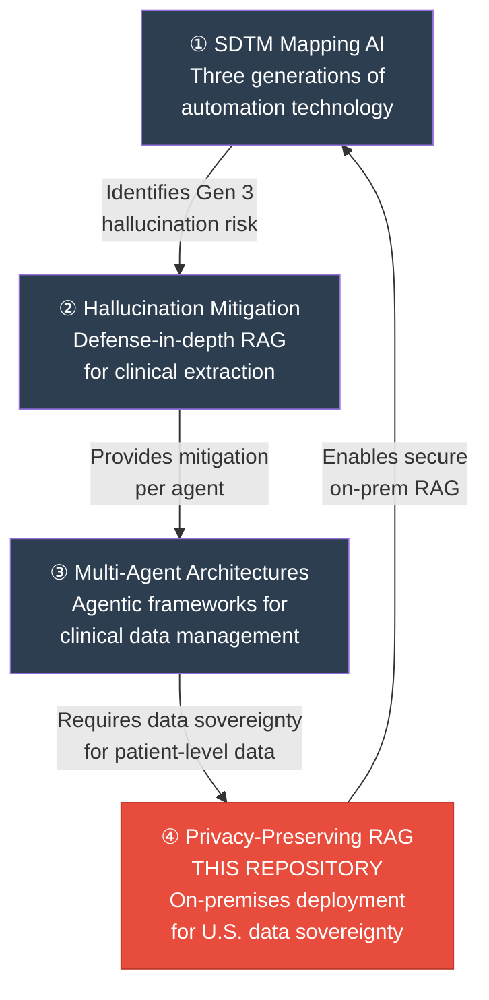

<p align="center">
  <strong>Privacy-Preserving Retrieval-Augmented Generation for Clinical Data Systems</strong><br/>
  <em>Architecture, Deployment, and Regulatory Compliance for On-Premises Healthcare AI</em>
</p>

<p align="center">
  
  
  
  
  
</p>

<p align="center">
  <a href="#the-problem">The Problem</a> •
  <a href="#regulatory-landscape">Regulatory Landscape</a> •
  <a href="#six-layer-reference-taxonomy">Architecture</a> •
  <a href="#technology-stack">Technology Stack</a> •
  <a href="#evaluation-framework">Evaluation</a> •
  <a href="#research-program-context">Research Program</a> •
  <a href="#citation">Citation</a>
</p>

-----

## The Problem

The dominant deployment paradigm for clinical AI — transmitting patient data to cloud-hosted proprietary models — creates an **irreconcilable conflict** with healthcare data sovereignty requirements:

|Risk Factor                            |Scale                                                                                                                 |
|---------------------------------------|----------------------------------------------------------------------------------------------------------------------|
|**Average healthcare data breach cost**|**$11.07 million** (IBM Security, 2024)                                                                               |
|**HIPAA violation penalties**          |Up to **$2.13 million** per violation category per year                                                               |
|**U.S. CLOUD Act exposure**            |U.S. government access to data held by U.S. companies *regardless of storage location* — unresolved conflict with GDPR|
|**Attack surface**                     |Every cloud API call transmits queries containing PHI through third-party infrastructure                              |

Three convergent technological trends now render **fully on-premises clinical RAG** architecturally viable:

1. **Open-weight model parity:** DeepSeek-R1 showed no significant difference vs. GPT-4o on 125 clinical cases (P = 0.3085) — *Nature Medicine* 2025
1. **Quantization maturity:** AWQ 4-bit reduces a 70B-parameter model from ~140 GB to ~35 GB VRAM — single A100 GPU deployment
1. **Inference engine throughput:** vLLM achieves 2–4× throughput vs. prior systems (peer-reviewed, SOSP 2023)

This paper presents a **six-layer reference taxonomy** for deploying clinical RAG entirely within an institutional security perimeter, with formally defined constraints on evidence grounding, access control, data residency, auditability, and uncertainty communication.

-----

## Paper Statistics

|Attribute                  |Value                                                                                 |
|---------------------------|--------------------------------------------------------------------------------------|
|**Type**                   |Reference taxonomy + evaluation framework                                             |
|**References**             |30+ (peer-reviewed systems, clinical, and regulatory literature)                      |
|**Layers Defined**         |6 (ingestion → chunking → vector storage → retrieval → inference → response filtering)|
|**Formal Constraints**     |5 (evidence grounding, access control, data residency, auditability, uncertainty)     |
|**Threat Vectors Analyzed**|4 (external adversary, insider threat, supply chain, inference-time leakage)          |
|**Ablation Dimensions**    |5 (retrieval method, chunking strategy, model scale, prompt guardrails, PHI filtering)|
|**Empirical Results**      |None — design-stage proposal with published component benchmarks                      |

-----

## Intended Audience

- **Healthcare IT security architects** designing AI infrastructure under HIPAA and GDPR
- **Pharmaceutical data science leaders** evaluating on-premises vs. cloud AI economics
- **Clinical decision support teams** requiring evidence-grounded LLM outputs with provenance
- **Drug repurposing researchers** needing RAG over biomedical literature and structured databases
- **GxP validation teams** assessing AI systems for 21 CFR Part 11 compliance
- **Legal and compliance counsel** reviewing data sovereignty guarantees for clinical AI

-----

## Regulatory Landscape

The most comprehensive regulatory mapping for on-premises clinical RAG deployment:

|Instrument                    |Specific Provision                            |Architectural Requirement                                                                                                   |
|------------------------------|----------------------------------------------|----------------------------------------------------------------------------------------------------------------------------|
|**HIPAA Privacy Rule**        |Minimum necessary standard                    |AI tools access only PHI strictly required for stated purpose                                                               |
|**HIPAA Security Rule NPRM**  |90 FR 898 (January 6, 2025)                   |Proposed: all safeguards mandatory (removes required/addressable distinction); risk analysis of all ePHI systems            |
|**21 CFR Part 11**            |§164.312 — Audit trails; electronic signatures|Immutable log: query, response, passages, user, timestamp, model version                                                    |
|**GDPR Article 9**            |Special category (health data)                |Explicit consent or legal basis (e.g., Article 9(2)(j) research exemption)                                                  |
|**EU AI Act**                 |Regulation 2024/1689, Annex III               |High-risk classification for healthcare AI; conformity assessment; research exemptions **do not apply** to clinical trial AI|
|**European Health Data Space**|In force March 2025; application from 2031    |Standardized secondary use access; European governance structure                                                            |
|**U.S. CLOUD Act**            |Cross-border data access                      |**Resolved by on-premises architecture:** no U.S.-headquartered cloud provider in data path                                 |
|**FDA GMLP**                  |10 guiding principles                         |Provenance tracking; representative datasets; deployed model monitoring                                                     |
|**FDA CDS Guidance**          |21st Century Cures Act exemption              |Clinical decision support requiring clinician interpretation may fall outside FDA device jurisdiction                       |

-----

## Six-Layer Reference Taxonomy

The architecture ensures **no patient data, query text, retrieved passages, or model activations leave the institutional security perimeter** at any point. PHI protection is enforced at every layer (defense-in-depth).

```mermaid
flowchart TB
    subgraph Perimeter["INSTITUTIONAL SECURITY PERIMETER"]
        direction TB

        subgraph L1["Layer 1: Document Ingestion"]
            L1A["Format Normalization<br/>(PDF, DOCX, HL7 FHIR, DB)"]
            L1B["PHI Detection via NER<br/>(F1: 0.93-0.97 on benchmarks)"]
            L1C["OCR with Confidence Scoring"]
        end

        subgraph L2["Layer 2: Structure-Aware Chunking"]
            L2A["Protocols: Section-aware<br/>(hierarchy preserved)"]
            L2B["Regulatory: Clause-level"]
            L2C["Literature: Semantic"]
            L2D["Structured DB: Record serialization"]
            L2E["500-1500 chars | 10-20% overlap<br/>Hierarchical parent pointers"]
        end

        subgraph L3["Layer 3: Encrypted Vector Storage"]
            L3A["Self-Hosted Vector DB<br/>(Milvus / Qdrant / pgvector)"]
            L3B["Local Embedding Model<br/>(BGE-large / PubMedBERT)"]
            L3C["ACL metadata per chunk<br/>Version-indexed snapshots<br/>Cryptographic hash integrity"]
        end

        subgraph L4["Layer 4: Hybrid Retrieval + Access Control"]
            L4A["BM25 Sparse<br/>(exact terminology)"]
            L4B["Dense ANN<br/>(semantic similarity)"]
            L4C["RRF Score Fusion"]
            L4D["Cross-Encoder Reranking<br/>(top K=50)"]
            L4E["ACL Pre-Filter BEFORE ANN<br/>(prevents embedding leakage)"]
        end

        subgraph L5["Layer 5: Quantized Local LLM Inference"]
            L5A["Llama-3.3-70B (AWQ 4-bit)<br/>~35 GB VRAM"]
            L5B["vLLM + PagedAttention<br/>2-4x throughput (peer-reviewed)"]
            L5C["Inline citation constraint<br/>Abstention instruction<br/>Refusal rules"]
        end

        subgraph L6["Layer 6: Response Filtering + Audit"]
            L6A["PHI Output Scanning<br/>(NER-based detection)"]
            L6B["Phantom Citation Verification<br/>(cite ID → passage check)"]
            L6C["Confidence Threshold Routing"]
            L6D["Immutable Audit Log<br/>per 21 CFR Part 11"]
        end

        L1 --> L2 --> L3 --> L4 --> L5 --> L6
    end

    L6 -->|"Confidence ≥ τ"| USER["Clinician / Researcher"]
    L6 -->|"Confidence < τ"| REVIEW["Human Expert Review"]

    style Perimeter fill:#0d1117,color:#ffffff,stroke:#e74c3c,stroke-width:3px
    style L1 fill:#2c3e50,color:#ffffff
    style L2 fill:#2c3e50,color:#ffffff
    style L3 fill:#7d3c98,color:#ffffff
    style L4 fill:#1a5276,color:#ffffff
    style L5 fill:#1a5276,color:#ffffff
    style L6 fill:#1a5276,color:#ffffff
    style USER fill:#1e8449,color:#ffffff
    style REVIEW fill:#e74c3c,color:#ffffff
```



### Formal Constraints

|Constraint                |Specification                                                                                                                                                              |
|--------------------------|---------------------------------------------------------------------------------------------------------------------------------------------------------------------------|
|**C1: Evidence Grounding**|Every factual claim in the response must be attributable to retrieved passages from documents in the user’s ACL                                                            |
|**C2: Access Control**    |Retrieval returns only passages from `ACL(user) ⊆ D`. No information from out-of-scope documents may influence the response, including through embedding similarity leakage|
|**C3: Data Residency**    |All computation occurs within the defined security perimeter `P`. No data transits outside `P`                                                                             |
|**C4: Auditability**      |Every query-response pair logged with retrieved passages, user identity, timestamp, and model version                                                                      |
|**C5: Uncertainty**       |System must abstain or explicitly communicate uncertainty when evidence is insufficient                                                                                    |

### Threat Model

|Threat Vector             |Description                                                                 |Mitigation                                                                           |
|--------------------------|----------------------------------------------------------------------------|-------------------------------------------------------------------------------------|
|**External Adversary**    |PHI exfiltration via prompt injection or side-channel                       |Air-gapped perimeter; delimiter tokens separating instructions from retrieved content|
|**Insider Threat**        |Adversarial queries exploiting embedding proximity to access restricted docs|**ACL pre-filtering BEFORE ANN search** (not post-filter — prevents ranking leakage) |
|**Supply Chain**          |Malicious model weights or corrupted vector DB binaries                     |Cryptographic verification; software provenance tracking                             |
|**Inference-Time Leakage**|LLM generating memorized PHI from pretraining corpora                       |Prompting-first strategy (no fine-tuning on institutional PHI); output PHI scanning  |

-----

## Technology Stack

### Inference Engines

|Engine          |Role                       |Key Evidence                              |Source Quality               |
|----------------|---------------------------|------------------------------------------|-----------------------------|
|**vLLM**        |Production serving         |2–4× throughput vs. FasterTransformer/Orca|**Peer-reviewed** (SOSP 2023)|
|**TensorRT-LLM**|NVIDIA-optimized production|~180–220 req/sec                          |Vendor documentation         |
|**Ollama**      |Air-gapped development     |Single-binary deployment                  |Project documentation        |
|**llama.cpp**   |CPU/GPU hybrid, edge       |GGUF Q5_K_M support                       |Project documentation        |

### Self-Hosted Vector Databases

|Database                    |License           |Key Evidence                          |Source Quality      |
|----------------------------|------------------|--------------------------------------|--------------------|
|**Milvus**                  |Apache 2.0        |Sub-10ms p50, billion-scale           |Vendor documentation|
|**Qdrant**                  |Apache 2.0        |20–50ms p50                           |Vendor documentation|
|**pgvector + pgvectorscale**|PostgreSQL        |471 QPS at 99% recall / 50M vectors   |Vendor benchmark    |
|**Weaviate**                |BSD-3 / Enterprise|~34ms p95; SOC 2/HIPAA enterprise tier|Vendor documentation|

### Open-Weight Models with Clinical Evidence

|Model                        |Clinical Evidence                                                                                                          |
|-----------------------------|---------------------------------------------------------------------------------------------------------------------------|
|**DeepSeek-R1**              |No significant difference vs. GPT-4o on 125 clinical cases (adjusted P = 0.3085) — *Nature Medicine* 2025 (Sandmann et al.)|
|**Llama-3-Meditron-70B**     |Outperforms GPT-4 (fine-tuned), Flan-PaLM, and Med-PaLM-2 on MedQA and MedMCQA                                             |
|**Llama-3.3-70B (AWQ 4-bit)**|~35 GB VRAM; single A100 80 GB with headroom for KV cache                                                                  |
|**Phi-4 14B**                |Strong performance-per-parameter for resource-constrained settings                                                         |

### Production Deployment Validation

> Griot et al. (2025, *PLOS Digital Health*) deployed a secure, GDPR-compliant, on-premises model with RAG integrated into the Epic EHR at a European university hospital. Over 5 months: **1,028 users**, **14,910 conversations**, with >50% of clinicians using it at least weekly. Primary uses: chart summarization, information retrieval, note drafting.

-----

## Evaluation Framework

### Metrics by Domain

|Domain                 |Metrics                                                                                                    |
|-----------------------|-----------------------------------------------------------------------------------------------------------|
|**Retrieval Quality**  |Recall@k, nDCG@k, MRR                                                                                      |
|**Generation Quality** |Factual accuracy (entailment classifier), faithfulness, citation accuracy, phantom citation rate           |
|**Drug Repurposing**   |Enrichment Factor (EF@100, EF@1000), Hit@k, AUROC, AUPRC                                                   |
|**Human Expert Review**|Correctness, Completeness, Evidence Quality, Safety (5-point Likert, ≥5 reviewers, Krippendorff’s α ≥ 0.67)|

### Five-Factor Ablation Design

|Ablation             |Variants                                                                       |What It Isolates                                      |
|---------------------|-------------------------------------------------------------------------------|------------------------------------------------------|
|**Retrieval Method** |BM25-only → dense-only → hybrid → hybrid + reranker                            |Marginal contribution of each pathway                 |
|**Chunking Strategy**|Fixed 500 char → fixed 1,500 → structure-aware → structure-aware + hierarchical|Impact on recall and generation faithfulness          |
|**Model Scale**      |Phi-4 14B → Llama-3.3-70B → Meditron-70B                                       |Effect of capacity and domain specialization          |
|**Prompt Guardrails**|None → citation-only → full citation + abstention + confidence                 |Hallucination rate, phantom citations, abstention rate|
|**PHI Filtering**    |With/without output scanning on synthetic PHI patterns                         |False-positive / false-negative safety margin         |

### Comparative Baselines

|Baseline                           |Purpose                                             |
|-----------------------------------|----------------------------------------------------|
|Direct LLM generation (no RAG)     |Isolates value of retrieval augmentation            |
|Cloud-based RAG (proprietary model)|Measures quality trade-off of on-premises deployment|
|Human expert responses             |Performance ceiling and inter-annotator agreement   |

-----

## Scope and Limitations

This paper presents a **design-stage architectural proposal** and technology synthesis, not an empirical systems evaluation. No prototype implementation or end-to-end benchmark has been conducted for the integrated pipeline. Individual component claims (model quality, inference throughput, vector database latency) are drawn from published literature and, where noted, from vendor benchmarks that have not been independently verified. The cost break-even analysis range (3.8–34 months vs. cloud) is broad and depends heavily on utilization assumptions not formally modeled. The architecture assumes English-language documents. Regulatory compliance analysis is based on regulations current as of early 2025 and may shift.

-----

## Repository Structure

```
privacy-rag-onprem/
├── README.md                              # This file
├── LICENSE
├── CITATION.cff
└── manuscript/
    └── privacy_preserving_rag.md           # Full manuscript
```

-----

## Research Program Context

This paper is part of a four-paper independent research program examining AI deployment in regulated clinical data environments:



|#    |Repository                                                                                         |Focus                                                                                    |
|-----|---------------------------------------------------------------------------------------------------|-----------------------------------------------------------------------------------------|
|**1**|[sdtm-mapping-ai](https://github.com/DanielMartin-Arogyasami/sdtm-mapping-ai)                      |Landscape review: what automation exists and what’s validated                            |
|**2**|[clinical-rag-hallucination](https://github.com/DanielMartin-Arogyasami/clinical-rag-hallucination)|The hallucination mitigation architecture used within each RAG layer                     |
|**3**|[clinical-query-agent](https://github.com/DanielMartin-Arogyasami/clinical-query-agent)            |Multi-agent orchestration consuming the on-premises RAG infrastructure                   |
|**4**|**[privacy-rag-onprem](https://github.com/DanielMartin-Arogyasami/privacy-rag-onprem)**            |**The infrastructure layer: how to deploy all of the above within HIPAA/GDPR boundaries**|

-----

## Citation

```bibtex
@article{arogyasami2026privacyrag,
  title   = {Privacy-Preserving Retrieval-Augmented Generation for Clinical Data
             Systems: Architecture, Deployment, and Regulatory Compliance for
             On-Premises Healthcare AI},
  author  = {Arogyasami, DanielMartin},
  year    = {2026},
  note    = {Preprint — design-stage proposal — not yet peer reviewed},
  url     = {https://github.com/DanielMartin-Arogyasami/privacy-rag-onprem}
}
```

-----

## Author

**DanielMartin Arogyasami** — Enterprise Clinical AI & Data Architect

[LinkedIn](https://linkedin.com/in/danielmba)

-----

## License

This manuscript is shared for academic discussion and independent scholarly review. See <LICENSE> for terms.

-----

## Integrity Statement

This paper presents a design-stage architectural proposal synthesized entirely from publicly available literature, open-source tools, and published regulatory texts. No proprietary systems, internal tools, or employer-specific infrastructure informed the design. The architecture is composed entirely of publicly documented, open-source components and well-established design patterns from the published literature. No clinical data was accessed. The author declares no conflicts of interest. No funding was received.

-----

**Keywords:** `retrieval-augmented generation` · `privacy-preserving AI` · `on-premises deployment` · `HIPAA` · `GDPR` · `EU AI Act` · `clinical decision support` · `data sovereignty` · `21 CFR Part 11` · `vLLM` · `quantization` · `AWQ` · `vector database` · `healthcare informatics` · `air-gapped deployment`
